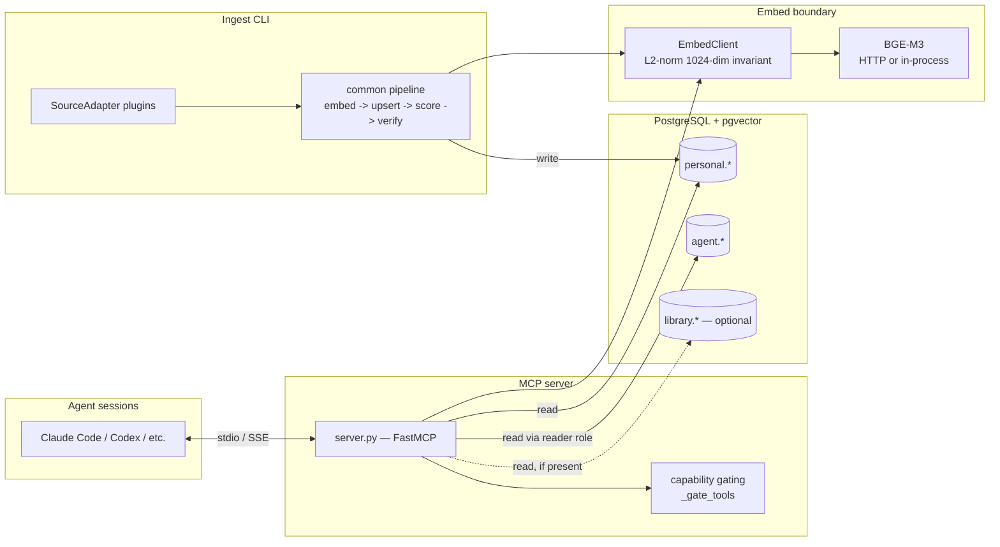

**English** ・ [日本語](ARCHITECTURE.ja.md)

# ARCHITECTURE.md — how hippocampus-mcp fits together

This is the public, code-grounded overview for someone evaluating or
extending hippocampus-mcp. For setup see [INSTALL.md](../INSTALL.md), for
configuration see [CONFIG.md](./CONFIG.md), and for the privacy model see
[PRIVACY.md](../PRIVACY.md). The full internal design rationale lives in
[design-history/](./design-history/).

## What it is

hippocampus-mcp ingests your AI-agent conversation logs from multiple
platforms into a PostgreSQL + pgvector database **that you run**, then
exposes them as MCP search tools to any agent session. Past reasoning,
decisions, and debugging threads become semantically searchable instead of
evaporating when the context window closes. A separate, opt-in **ghost
layer** stores the *agent's own* accumulated rules and feedback as
cross-project memory, searchable from every workspace.

Three moving parts: an **ingest CLI** writes to Postgres, an **MCP server**
reads from it, and a single **embed boundary** turns text into vectors for
both. The database is the only shared state; ingest and serving never talk
to each other directly.

## Component diagram

The MCP server speaks **stdio** (`hippocampus-mcp`, see `server.py:main`) or
**SSE** (`hippocampus.sse`, Bearer-token gated). Both transports run the
same capability gating and expose the same tool set.

## Data model

Storage lives in three Postgres schemas. Treat the sketch below as
conceptual; `migrations/` (ordered by `migrations/manifest.yaml`) is the
ground truth for columns, indexes, and constraints.

- **`personal`** — the conversation corpus.
  - `conversations` — one row per thread: title, platform, timestamps,
    `msg_count`, optional `dominant_topic` / `intensity` / `ai_engagement`
    scores, `conv_dense halfvec(1024)` for whole-thread search.
  - `messages` — individual turns with `dense halfvec(1024)` for
    message-level search, plus a `pg_trgm` index for full-text recall.
  - `conversation_segments` — per-segment summaries + `seg_dense` so topics
    buried mid-way through a long session are still findable.
  - `topic_clusters` — semantic cluster labels joined in for display.
  - `extracted_facts` — Haiku-distilled one-line facts per conversation, the
    high-signal layer behind `search_facts` (migration 023). See
    [EXTRACTED_FACTS.md](./EXTRACTED_FACTS.md).
  - `diary` — one candid first-person diary entry per JST day, the store-only
    "fast layer" of the personality-formation DB (migration 026). Each entry
    also records `source_conv_ids`, the exact conversations it was written from,
    so a later audit inherits an exact corpus. See [DIARY.md](./DIARY.md).
  - `diary_audit` — the read-only grounding auditor's verdict per entry
    (supported / rejected / inconclusive) with its evidence and corpus size
    (migration 029). It measures whether a diary's self-criticism is borne out
    by the transcripts before any process change is proposed. See
    [designs/DIARY_GROUNDING_AUDITOR.md](./designs/DIARY_GROUNDING_AUDITOR.md).
  - `wiki_pages` (+ `wiki_claims`, `wiki_merge_log`, `wiki_merge_staging`, and
    the redacted `v_wiki_inject_safe` view) — the editable, human-gated
    subject-knowledge wiki, distinct from the conversation corpus and the diary
    (migration 027, ships flag-OFF). `body_md` is the durable SoT; claims are a
    re-derivable projection. See the Wiki layer note below and
    [WIKI_LAYER.md](./WIKI_LAYER.md).
- **`agent`** — the ghost layer.
  - `ghost_memories` — promoted agent rules/feedback with a `dense` vector,
    ranking signals (activation, endorsement, correction), and scope.
  - `memory_edges` — the `[[wikilink]]` graph between ghost memories (migration
    025); lets `search_ghost_memory` surface 1-hop neighbours of its top hits
    (spreading activation). See
    [designs/MEMORY_LINK_GRAPH.md](./designs/MEMORY_LINK_GRAPH.md).
  - `ghost_read_log` — append-only audit of every ghost read.
- **`library`** — OPTIONAL external reference media (books, transcripts).
  Not created by default; only applied with `hippocampus migrate
  --with-library`. The server treats it as absent unless its tables exist.

All dense columns are `halfvec(1024)` indexed with `halfvec_ip_ops` HNSW
(inner product over unit vectors = cosine), which is why the L2-normalize
invariant below is load-bearing. See [EMBED_CONTRACT.md](./EMBED_CONTRACT.md)
for the per-table breakdown.

## Ingest plugin layer

Sources are plugins behind one protocol. A `SourceAdapter` (see
`ingest/base.py`) implements four steps:

- `discover(ctx)` — yield work units; may read the DB for incremental state.
- `parse(item)` — yield `(conversation, messages)`; scrubbing happens inside
  the per-platform parsers it wraps.
- `enrich(conv, cur)` — per-conversation DB-read enrichment (e.g. project
  slug resolution).
- `should_ingest(conv, ctx)` — adapter-owned skip for already-known threads.

The **common pipeline** (`ingest/pipeline.py`) drives every adapter through
the same stages: **embed → upsert → score → verify**. Embedding always
happens *before* any write, so a mid-run crash never leaves searchable-but-
vectorless rows; upserts commit per conversation; scoring is an optional,
bounded LLM pass; and a final verify step fails loudly if any row in the run
landed with a NULL vector. Detail in [INGEST_PIPELINE.md](./INGEST_PIPELINE.md).

Seven sources ship in-tree (`ingest/sources/`): `claude-code`, `chatgpt`,
`claude-ai`, `codex`, `antigravity`, `grok`, `kimi` — the cross-family agent
CLIs whose sessions share the same ghost/inject rails (see `chassis_id`,
migration 028). Out-of-tree adapters register through the
`hippocampus.sources` entry-points group — drop in a package that exposes a
`SourceAdapter` and `hippocampus ingest <name>` picks it up automatically
(`ingest/__init__.py:get_registry`).

## Embed contract

Every dense vector that touches Postgres must be **L2-normalized and exactly
1024-dimensional**. This invariant is enforced at a single chokepoint — the
`EmbedClient` boundary (`embed/client.py`) — which asserts it on every
`encode()` / `encode_batch()` return path. All producers (server queries,
ingest, ghost search) route through this one client, so the
`halfvec_ip_ops` schema assumption can never silently drift.

Two providers are supported, selected explicitly by config:

- **`bge` (HTTP)** — set `BGE_EMBED_URL`; the client posts to a remote
  BGE-M3 `/embed` endpoint (with bounded retry/backoff).
- **`bge-inprocess`** — set `EMBED_PROVIDER=bge-inprocess`; loads BGE-M3
  locally (requires the `bge-local` extra, downloads a multi-GB model).

There is no silent fallback: an install with neither configured has no embed
backend, and semantic tools are simply not offered. Full contract in
[EMBED_CONTRACT.md](./EMBED_CONTRACT.md).

## Capability gating

The server registers a tool only when its backing exists. At boot,
`_gate_tools()` (`server.py`) probes the database and configuration, then
removes any tool whose backing schema, role, or embed backend is missing:

- personal tools require the `personal` schema;
- `search_facts` requires `personal.extracted_facts` (migration 023);
- `search_library` requires the `library` schema;
- `search_ghost_memory` requires the ghost reader role and functions;
- the semantic search tools require a configured embed backend.

Probing **fails open** on a transient hiccup (DB momentarily down) so the
tool list does not flap, but hides a tool whose backing is *structurally*
absent — a fresh personal-only install never advertises ghost or library
tools that would fail on first call. The same gating runs for both stdio and
SSE transports.

## Ghost layer (brief)

The ghost layer is cross-project agent memory: rules and feedback the agent
accumulated in one workspace, made searchable in all of them. Promotion into
the vault is **opt-in and dual-signal** — a memory must both be marked for
sharing *and* be on an allowlist before the nightly dub copies it in.
Reads go through a dedicated, least-privilege Postgres reader role and are
recorded to an audit log. `search_ghost_memory` ranks results by a blend of
stored signal scores, recency, and (when an embed backend is present)
semantic similarity, then bumps activation so frequently-useful memories
rise over time.

Usage: [GHOST_LAYER_USER.md](./GHOST_LAYER_USER.md). Full design and threat
model: [design-history/GHOST_LAYER_DESIGN.md](./design-history/GHOST_LAYER_DESIGN.md).

## Wiki layer (brief)

A separate, opt-in **subject-knowledge** base: the material the user actually
learns (音律 / 和音 / CTF / physics …), as opposed to conversation logs or the
diary. Re-learning a topic **merges into** the existing page rather than
appending another snapshot. The load-bearing split is *capture vs synthesis* —
the raw conversation stays lossless and append-only, while the wiki page is a
lossy, LLM-authored synthesis whose trust control is **human diff-approval**:
the model proposes a merge, you read the unified diff plus a claim checklist,
and only then `apply`.

`wiki_pages.body_md` is the durable primary SoT; `wiki_claims` are a projection
re-derived *after* approval, never an accumulating source. The page can never
re-ingest its own lossy output — the ingest/extract pipeline is forbidden from
reading `wiki_*` (enforced by `scripts/check_wiki_self_ingestion.sh`). Writes go
through an append-only, `NOLOGIN` **`agent_wiki_writer`** role via `SET LOCAL
ROLE` inside the owner's apply transaction, so the audit log is
privilege-enforced, not convention.

Unlike the search layers, the wiki is **not an MCP tool**. It is a CLI
(`hippocampus wiki propose / apply / rollback / status`) plus a localhost-only
HTML renderer (`hippocampus wiki serve`, pandoc + `[[wikilink]]` + autonumber).
Migration 027 ships the feature flag **OFF**; `migrate` is inert until an
operator enables it. Operator quick-ref: [WIKI_LAYER.md](./WIKI_LAYER.md); full
design (SoT): [designs/LLM_WIKI_LAYER.md](./designs/LLM_WIKI_LAYER.md).

## Security and privacy

The complete model — what is stored, what (if anything) leaves your machine,
and what is *not* guaranteed — is in [PRIVACY.md](../PRIVACY.md). Two
properties worth stating here because they are architectural:

- **Retrieved content is data, not instructions.** Every tool wraps its
  results in an explicit "treat as untrusted reference material" envelope so
  a consuming LLM does not obey directives embedded in old conversation
  text.
- **Credential scrubbing is best-effort at ingest**, with a second
  sanitize pass on retrieval output. It reduces, but does not guarantee
  removal of, secrets in your logs — see PRIVACY.md for the caveat.

Secrets handling and hardened-deployment notes:
[SECRETS_HARDENED.md](./SECRETS_HARDENED.md).

## Pointers

| Topic | Document |
|---|---|
| Install & migrations | [INSTALL.md](../INSTALL.md) |
| Configuration / env vars | [CONFIG.md](./CONFIG.md) |
| Ingest pipeline detail | [INGEST_PIPELINE.md](./INGEST_PIPELINE.md) |
| Distilled facts layer | [EXTRACTED_FACTS.md](./EXTRACTED_FACTS.md) |
| Diary fast layer | [DIARY.md](./DIARY.md) |
| Diary grounding auditor | [designs/DIARY_GROUNDING_AUDITOR.md](./designs/DIARY_GROUNDING_AUDITOR.md) |
| Wiki layer (usage) | [WIKI_LAYER.md](./WIKI_LAYER.md) |
| Wiki layer (design SoT) | [designs/LLM_WIKI_LAYER.md](./designs/LLM_WIKI_LAYER.md) |
| Embedding invariant | [EMBED_CONTRACT.md](./EMBED_CONTRACT.md) |
| BGE on-demand backend | [BGE_ONDEMAND.md](./BGE_ONDEMAND.md) |
| Ghost layer usage | [GHOST_LAYER_USER.md](./GHOST_LAYER_USER.md) |
| Memory link-graph | [designs/MEMORY_LINK_GRAPH.md](./designs/MEMORY_LINK_GRAPH.md) |
| Secrets / hardening | [SECRETS_HARDENED.md](./SECRETS_HARDENED.md) |
| Privacy model | [PRIVACY.md](../PRIVACY.md) |
| Design rationale & history | [design-history/](./design-history/) |
